# IDEA Debug 技巧
## 行断点
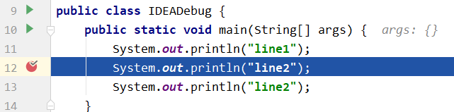
- 在某一行左侧单击，然后以debug模式运行main()

## 方法断点
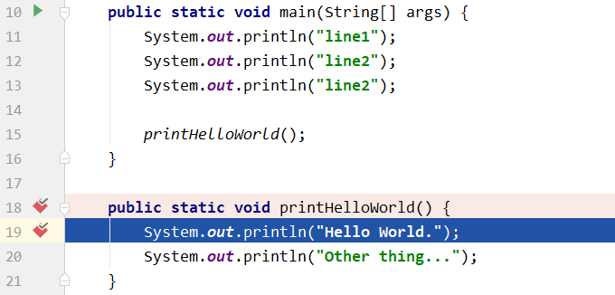
- 在某个方法定义的左侧单击，然后以debug模式运行该方法。
- debug会停留于该方法的第一行。

## 异常断点
新建一个自定义运行时异常CustomException
```java
public class CustomException extends RuntimeException {
    public CustomException(String message) {
        super(message);
    }

    public CustomException(String message, Throwable cause) {
        super(message, cause);
    }
}
```
设置IDEA异常断点


- `+` Java Exception Breakpoints 根据名称搜索CustomException并确定。
- 以debug模式运行会抛出CustomException的方法。会发现将停留于throw这行。

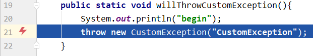

## 断点调试工具栏
### Step Over(F8)
一步一步往下走，直接执行方法体

### Step Into(F7)
遇到方法，会进入方法体里面。不会进入官方类库的方法。

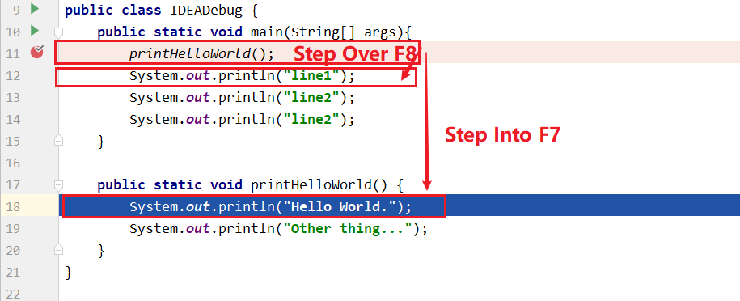

### Force Step Into(Alt + Shift + F7)
遇到方法，会进入方法体里面。可以进入官方类库的方法。

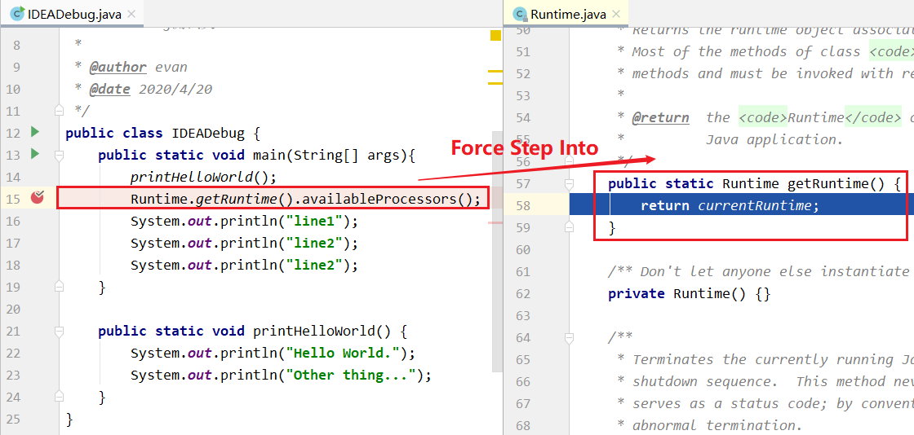

### Step Out(Shift + F8)
跳出整个方法体。执行到方法体外的下一行。

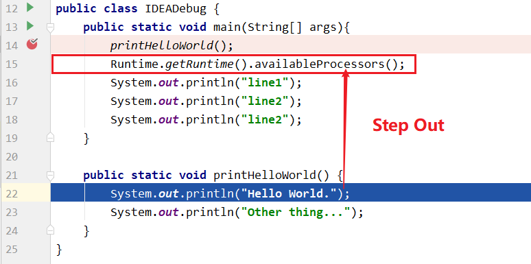

### Drop Frame
回退一个Frame，即回退到进入时的方法。一个Frame最小单位应该是一个方法级别。

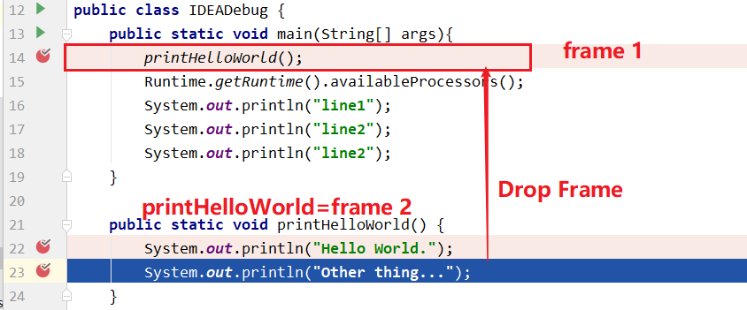

### Run to Cursor(Alt + F9)
运行到光标处。

### Evaluate Expression
计算表达式的值。


## 条件断点
代码行左侧单击，然后右键。在condition框输入条件。

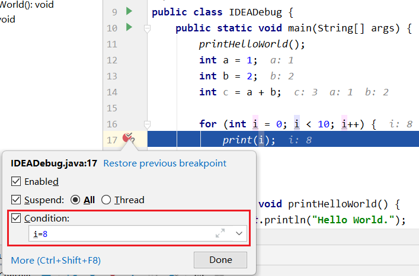

## 调试多线程
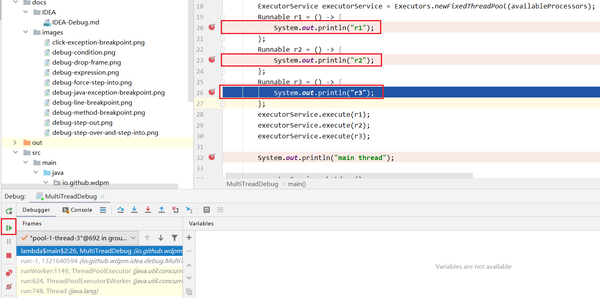

- 请注意：使用resume program 按钮来让thread执行，同时保证suspend级别为thread。
## 中断调试
在调试过程中，不想执行当前断点后面的代码再退出。
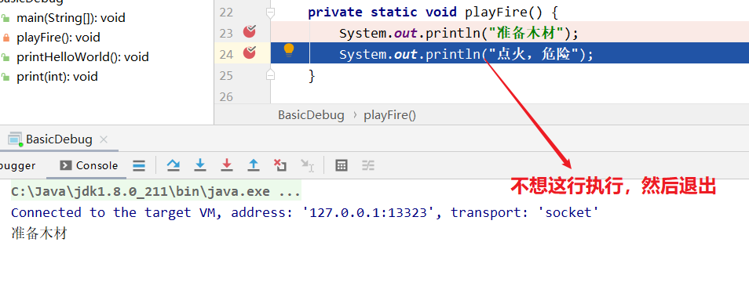

第一次点击force return。

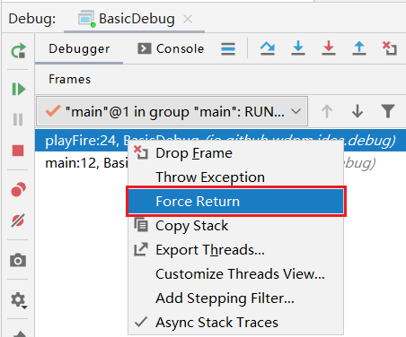

再次右键，点击force return。

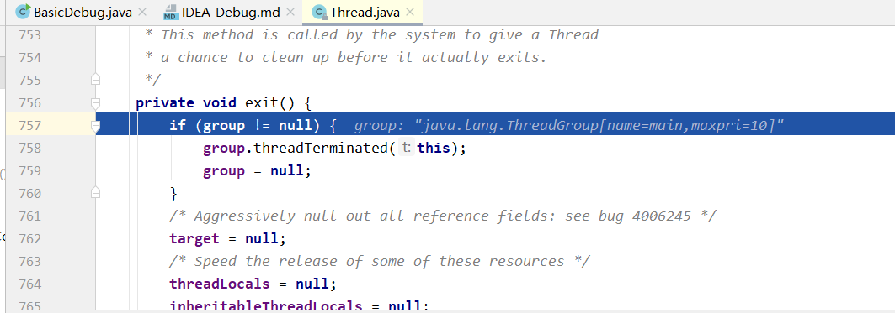
